<div align="center">



</div>

<br/>

<div align="center">

</div>

<br/>

---

<div align="center">

### ✦ About This Repository ✦

*Complete semester lab archive for* ***Programming for Artificial Intelligence*** —
*every notebook, every script, every concept — organised and growing week by week.*

<br/>


<br/>


</div>

---

<div align="center">

### 🗂 Repository Structure

</div>

```
📦 Programming-For-Artificial-Intelligence-Lab-24PWAI0032/
│
├── 📁 Lab01 ─── Python Fundamentals
│    └── Lab1_24PWAI0032.ipynb   →  Variables · I/O · Conditions · Loops · Functions
│
├── 📁 Lab02 ─── Data Structures                    (coming soon)
├── 📁 Lab03 ─── File Handling & OOP                (coming soon)
├── 📁 Lab04 ─── NumPy & Pandas                     (coming soon)
├── 📁 Lab05 ─── Data Visualization                 (coming soon)
├── 📁 Lab06 ─── Machine Learning                   (coming soon)
├── 📁 Lab07 ─── Neural Networks                    (coming soon)
│    ···
└── 📁 LabNN ─── Final Lab Project
```

> 📌 Naming convention: **`LabXX_24PWAI0032.ipynb`**

---

<div align="center">

### 🧪 Lab Progress Tracker

| # | Lab | Topics Covered | Status |
|:---:|:---|:---|:---:|
| `01` | **Python Fundamentals** | Variables, I/O, Conditions, Loops, Functions, Types | ✅ Complete |
| `02` | Data Structures | Lists, Tuples, Dicts, Sets | 🔜 Upcoming |
| `03` | File Handling & OOP | Classes, Objects, File I/O | 🔜 Upcoming |
| `04` | NumPy & Pandas | Arrays, DataFrames, Wrangling | 🔜 Upcoming |
| `05` | Data Visualization | Matplotlib, Seaborn, Plotly | 🔜 Upcoming |
| `06` | Machine Learning | Regression, Classification, Evaluation | 🔜 Upcoming |
| `07` | Neural Networks | TensorFlow, Keras, Deep Learning | 🔜 Upcoming |
| `…` | More Labs | — | 🔒 Locked |

</div>

---

<div align="center">

### 🛠 Tech Stack

<table>
<tr>
  <td align="center" width="110">
    <br/>
    <sub><b>Python</b></sub>
  </td>
  <td align="center" width="110">
    <br/>
    <sub><b>Jupyter</b></sub>
  </td>
  <td align="center" width="110">
    <br/>
    <sub><b>VS Code</b></sub>
  </td>
  <td align="center" width="110">
    <br/>
    <sub><b>TensorFlow</b></sub>
  </td>
  <td align="center" width="110">
    <br/>
    <sub><b>GitHub</b></sub>
  </td>
</tr>
</table>

</div>

---

<div align="center">

### 🌙 Semester Learning Roadmap

</div>

```python
# Syed Hassan Tayyab · 24PWAI0032 · UET Peshawar · Spring 2025

roadmap = {
    "✅  Phase 1 — Foundations"    : ["Python syntax, variables, I/O",
                                      "Control flow, loops, functions",
                                      "Type checking, comments"],

    "📌  Phase 2 — Data Mastery"   : ["NumPy arrays & operations",
                                      "Pandas DataFrames & data cleaning"],

    "📌  Phase 3 — Visualization"  : ["Matplotlib, Seaborn, Plotly",
                                      "Storytelling with data"],

    "📌  Phase 4 — ML Foundations" : ["Supervised & unsupervised learning",
                                      "Scikit-learn pipelines & evaluation"],

    "📌  Phase 5 — Deep Learning"  : ["Neural networks with Keras & TF",
                                      "Real-world AI capstone project 🚀"],
}
```

---

<div align="center">

### 📊 GitHub Stats

<br/>

[](https://github.com/24pwai0032-gif)

<br/>


&nbsp;&nbsp;


<br/><br/>


</div>

---

<div align="center">

### 🌸 About Me

<br/>



<br/><br/>

[](mailto:hassanayaxy@gmail.com)
&nbsp;&nbsp;
[](https://www.linkedin.com/in/syedhassantayyab/)
&nbsp;&nbsp;
[](https://github.com/24pwai0032-gif)

</div>

---

<div align="center">

<br/>


&nbsp;

&nbsp;


<br/><br/>


</div>
